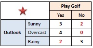

**Explainable Machine Learning via Argumentation (EMLA)**

This repo will host a generalized version of [ArgEML](https://github.com/nicolepr/argeml), 
a general Explainable Machine Learning Framework and Methodology based on Argumentation. 
For more information please refer to paper [Explainable Machine Learning via Argumentation](https://link.springer.com/chapter/10.1007/978-3-031-44070-0_19).

At the moment, the repo includes the `oner` library that learns single condition rules from a given dataset using the concepts of 
"One Rule" classification algorithm [OneR](https://www.saedsayad.com/oner.htm). The library currently supports datasets with categorical and numerical features.

***OneR***

OneR algorithm generates one rule for each predictor in a dataset, then selects the rule with the smallest total error as its "one rule". 
The `oner` implementation in this repo generates "one rule" for each predictor, by assessing the product of its coverage and accuracy `(coverage * (1-error))`
and provides various options for the consuming application to select one rule.

To create a rule for a predictor, a frequency table is constructed for each predictor against the target. 
For `categorical` features the test conditions are `predictor=value_i` (for each discrete predictor value). For example:



For each condition the most frequent (majority) class is assigned to the rule:
```
>> IF outlook=sunny THEN Yes [coverage=5/14, accuracy=3/5]
>> IF outlook=overcast THEN Yes [coverage=4/14, accuracy=1]
>> IF outlook=rainy THEN No [coverage=5/15, accuracy=2/5]
```
The different rules that can be generated from a single predictor are assessed based on their `coverage*accuracy` score:
```
>> IF outlook=sunny THEN Yes [coverage=5/14, accuracy=3/5] [score=0.21]
>> IF outlook=overcast THEN YES [coverage=4/14, accuracy=1] [score=0.28]
>> IF outlook=rainy THEN No [coverage=5/15, accuracy=2/5] [score=0.13]
```
The rule with the highest score is selected as the `one rule` for the predictor.

For `numerical` features splitting points are calculated and used to test conditions like 
`predictor >= split_point_i AND predictor < split_point_j`.

## Usage
- Add `emla` module as a dependency to your project

```xml
    <dependency>
        <groupId>org.emla</groupId>
        <artifactId>emla</artifactId>
        <version>0.0.2-SNAPSHOT</version>
    </dependency>
```

- Load data into a `Dataset` object, create a new `LearningSession` and calculate frequencies. 

```Java
Dataset ds = new Dataset("./src/test/resources/agentRequests.csv", "resourceAccess", "access", 1, 0);
LearningSession emlaSession = new LearningSession(ds,"resourceAccess");
List<FrequencyTable> frequencyTables = emlaSession.calculateFrequencyTables(ds, "train",null);
frequencyTables.forEach(f -> System.out.println(f.toString()));
```
- Frequency examples:
```
** Frequency Table for predictor 'role':

>> role == admin (target=allow), (coverage=0.33, accuracy=1, assessment=0.33):
	[allow, 3]
>> role == contributor (target=allow), (coverage=0.44, accuracy=0.5, assessment=0.22):
	[allow, 2]	[deny, 2]
>> role == guest (target=deny), (coverage=0.22, accuracy=1, assessment=0.22):
	[deny, 2]

** Frequency Table for predictor 'age':

>> age < 35.0 (target=deny), (coverage=0.33, accuracy=1, assessment=0.33):
	[allow, 0]	[deny, 3]
>> age >= 35.0, age < 45.0 (target=allow), (coverage=0.33, accuracy=1, assessment=0.33):
	[allow, 3]	[deny, 0]
>> age >= 45.0 (target=allow), (coverage=0.33, accuracy=0.67, assessment=0.22):
	[allow, 2]	[deny, 1]
```
- Select a frequency to create a rule:
```Java
Frequency newFrequency = emlaSession.calculateFrequencyHighCoverageLowError(frequencyTables, "allow");
```